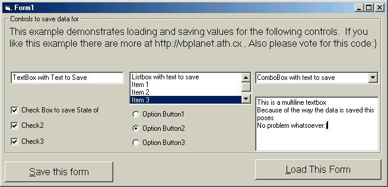



## Store TextBox, ListBox, and other controls values in a file then restore them from a file\.

### Description

This code will save values for TextBox, CheckBox, ListBox, ComboBox, OptionButton, and MultiLine TextBoxes with no problem. It demonstrates using the controls collection to go through all controls contained on a form and save their values. It also has an error handler that gives abort, Retry and ignore options on errors. It uses conditional compilation to help with debugging by printing values to the debug window. This behavior can be changed by changing #const debugmode to 0. The file will automatically be saved in the same directory as your application and will contain the forms name with an extenstion of .set.
 
### More Info
 
a Form Object

             |
---                |---
**Submitted On**   |2001-03-04 22:44:52
**By**             |[http://www\.mp3trivia\.com](https://github.com/Planet-Source-Code/PSCIndex/blob/master/ByAuthor/http-www-mp3trivia-com.md)
**Level**          |Beginner
**User Rating**    |4.2 (25 globes from 6 users)
**Compatibility**  |VB 6\.0
**Category**       |[Files/ File Controls/ Input/ Output](https://github.com/Planet-Source-Code/PSCIndex/blob/master/ByCategory/files-file-controls-input-output__1-3.md)
**World**          |[Visual Basic](https://github.com/Planet-Source-Code/PSCIndex/blob/master/ByWorld/visual-basic.md)
**Archive File**   |[CODE\_UPLOAD15947342001\.zip](https://github.com/Planet-Source-Code/http-www-mp3trivia-com-store-textbox-listbox-and-other-controls-values-in-a-file-then-rest__1-21522/archive/master.zip)

